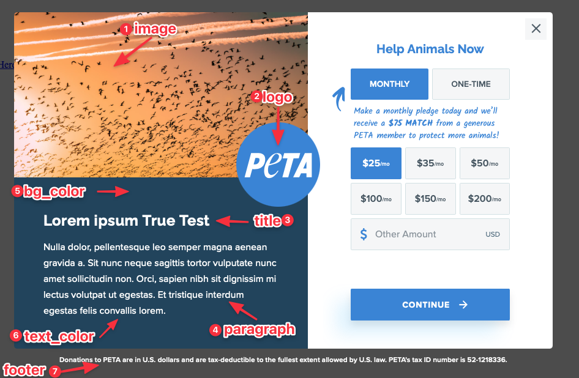

# Engrid Multistep Lightbox

This project makes it easy to create links to your Engaging Networks Donation Page as a lightbox with multiple steps.

## How to use

1. Add the script below to the page:

```html
<script
  defer="defer"
  src="https://acb0a5d73b67fccd4bbe-c2d8138f0ea10a18dd4c43ec3aa4240a.ssl.cf5.rackcdn.com/10003/donation-lightbox-parent.js"
></script>
```

2. The script will look for the `data-donation-lightbox` attribute on every `a` tag and make it open as a lightbox, with the options below.

## Options

Every option can be set as a data attribute on the `a` tag, or as a JavaScript object.



- **name**: The name of the lightbox. This is used to identify the lightbox in Google Analytics. Defaults to "4Site Multi-Step Splash".
- **image** - Main Image of the Lightbox.
- **video** - Main Video of the Lightbox. If used, the **image** option will be used as a poster image.
- **autoplay** - If true, the video will autoplay, be muted, and loop.
- **logo** - Logo Image Used on the center of the Lightbox. On mobile, it will be scaled down and moved to the top.
- **divider** - Divider Image Used between the Hero Image and Content.
- **title** - Title of the Lightbox.
- **mobile_enabled** - Enable the mobile version of the lightbox. Defaults to false.
- **mobile_title** - Title of the Lightbox on mobile.
- **paragraph** - Content of the Lightbox.
- **mobile_paragraph** - Content of the Lightbox on mobile.
- **bg_color** - HEX color of the left column background.
- **text_color** - HEX color of the left column text.
- **form_color** - HEX color for the form theme.
- **footer** - Content of the footer.
- **url** - URL of the donation page - use this option if you want the lightbox to automatically open when the page loads.
- **cookie_hours** - Number of hours to not auto open the lightbox after the user closes it.

Because the page can have multiple lightbox links, you can share options between them by creating a `DonationLightboxOptions` object. Example:

```javascript
DonationLightboxOptions = {
  name: "Super Ultra Mega Donation Lightbox",
  logo: "https://www.peta.org/wp-content/themes/petaorg/assets/images/peta-logo.svg",
  footer:
    "Donations to PETA are in U.S. dollars and are tax-deductible to the fullest extent allowed by U.S. law. PETA's tax ID number is 52-1218336.",
};
```

On the example above, the logo and footer will be used for all links.

**Example of Link Without Lightbox:**

```html
<a href="https://support.peta.org/page/32254/donate/1">Give Now</a>
```

**Example of Link With Lightbox:**

```html
<a
  href="https://support.peta.org/page/32254/donate/1"
  data-donation-lightbox
  data-name="Super Ultra Mega Donation Lightbox"
  data-title="My Title Test"
  data-paragraph="My paragraph test"
  >Give Now
</a>
```

### IMPORTANT: This project only works with the Engaging Networks Pages using the [engrid-peta theme](https://github.com/4site-interactive-studios/engrid-peta).

## Development

Your js code must be on the `src/app` folder. Styling changes must be on `src/scss`.

## Install Dependencies

1. `npm install`

## Deploy

1. `npm run build` - Builds the project
2. `npm run watch` - Watch for changes and rebuilds the project

It's going to create a `dist` folder, where you can get the `donation-lightbox-parent.js` file and publish it.

Currently it's published on:  
https://acb0a5d73b67fccd4bbe-c2d8138f0ea10a18dd4c43ec3aa4240a.ssl.cf5.rackcdn.com/10003/donation-lightbox-parent.js
